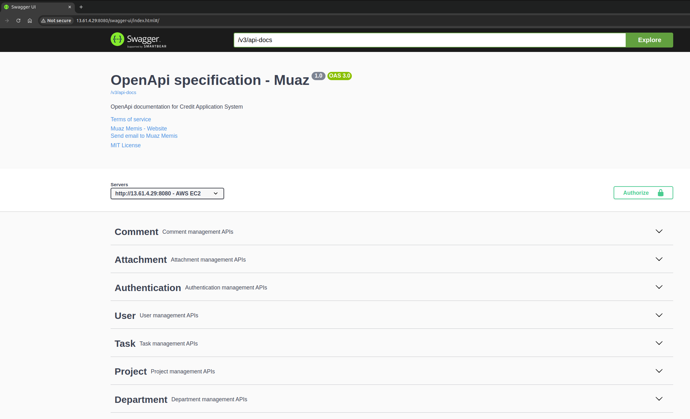
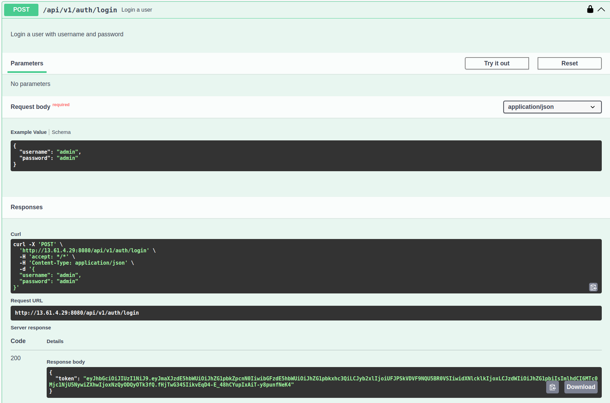
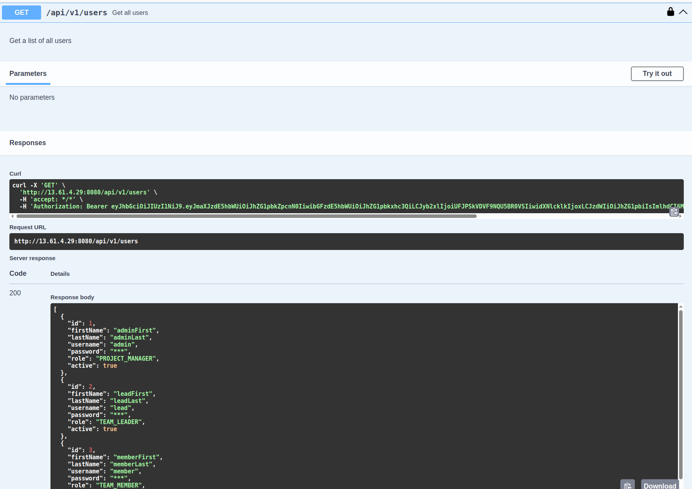
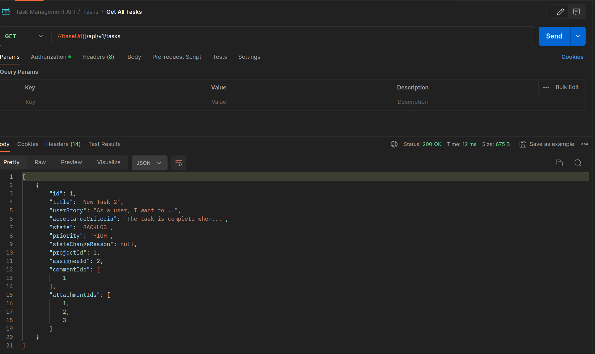
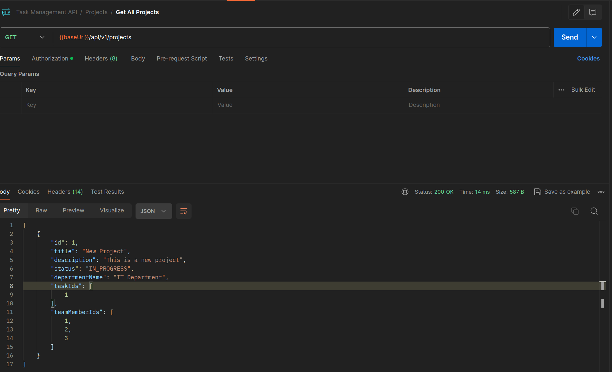
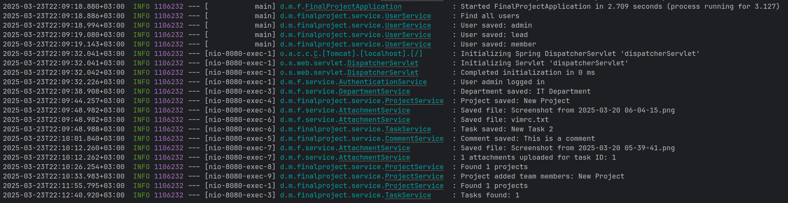

# Advanced Task Management System

This project is the final project for Patika.dev & DefineX Java Spring Boot Bootcamp. The Advanced Task Management System is a modern application designed to facilitate project management, task tracking, and team collaboration for companies.



## 📋 Project Features

### Project and Task Management

- **Department-Based Projects**: Projects can be created and managed based on departments
- **Task Assignment and Tracking**: Tasks can be created, assigned, and tracked within projects
- **Status Tracking**: Task statuses (Backlog, In Analysis, In Progress, Cancelled, Blocked, Completed) can be monitored
- **Priority Setting**: Priority levels (Critical, High, Medium, Low) can be assigned to tasks



### User Roles and Permissions

- **Project Manager**: Can manage all projects and tasks
- **Team Leader**: Can assign tasks and change their statuses
- **Team Member**: Can manage tasks assigned to them and update their statuses



### File Management and Comments

- **File Attachments**: Files can be attached to tasks and viewed
- **Comment System**: Comments can be added to tasks



## 🔒 Business Rules and Constraints

### Status Management Rules

- Backlog <=> In Analysis <=> In Progress <=> Completed
- A task can be moved to Cancelled from any state except Completed
- Transitions between In Analysis <=> Blocked and In Progress <=> Blocked are allowed
- A reason must be provided when transitioning to Cancelled or Blocked status
- Tasks in Completed status cannot be moved to another status or edited



### Team Member Permissions

- Team members (excluding Team Leaders and Project Managers) cannot change task titles and descriptions
- Team members can change task statuses, attachments, and add comments

## 💻 Technical Details

- **Backend**: Java 21, Spring Boot 3
- **Database**: PostgreSQL (with H2 support for development)
- **Documentation**: API documentation with Swagger UI
- **Security**: JWT-based authentication
- **Test Coverage**: Unit tests with 80%+ coverage



## 🚀 Setup and Running

### Requirements

- Java 21
- Maven
- PostgreSQL database

### Steps

1. Clone the project:

```sh
git clone https://github.com/muazmemis/task-management.git
cd task-management
```

2. Build the application:

```sh
mvn clean install
```

3. Run the application:

```sh
mvn spring-boot:run
```

## 🧪 Testing

To run unit tests:

```sh
mvn test
```

## API Documentation

- Local: [Link](http://localhost:8080/swagger-ui.html)
- AWS EC2: [Link](http://localhost:8080/swagger-ui.html)

## 📝 License

This project is licensed under the [MIT](LICENSE) license.
